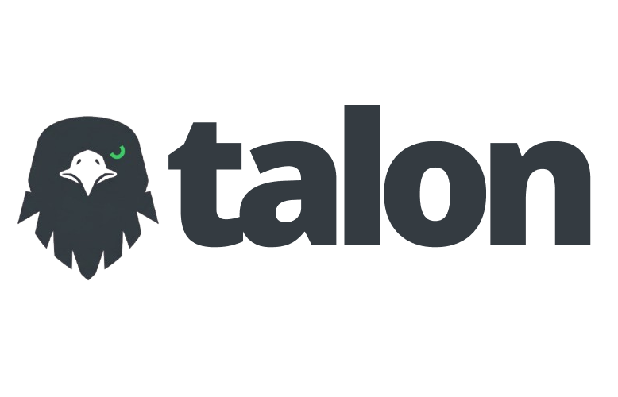

</img>

# About

Talon is an autonomous daemon written in Elixir that manages the lifecycle of containerized applications on a single machine.

> [!WARNING]
> Early stage project. Work in progress.

## Overview

Talon connects to an external control panel via a persistent WebSocket connection. The panel sends commands, Talon executes them. Nodes never need to be publicly accessible — only the panel requires a public WSS endpoint.

Each application runs as an isolated OTP process. If one application crashes, it does not affect any other application on the same node.

## Deploy Strategies

- **Dockerfile** — clone a repository, build and run.
- **Registry** — pull a pre-built image and run.

## License

MIT